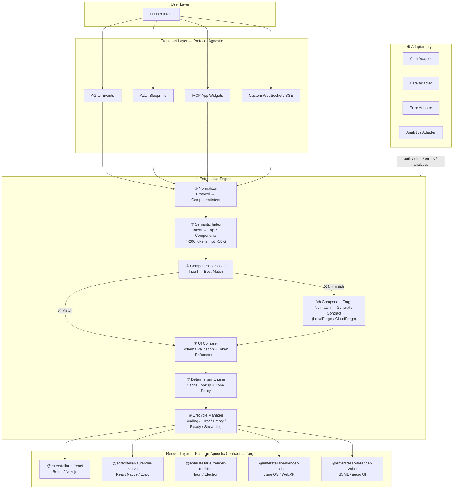
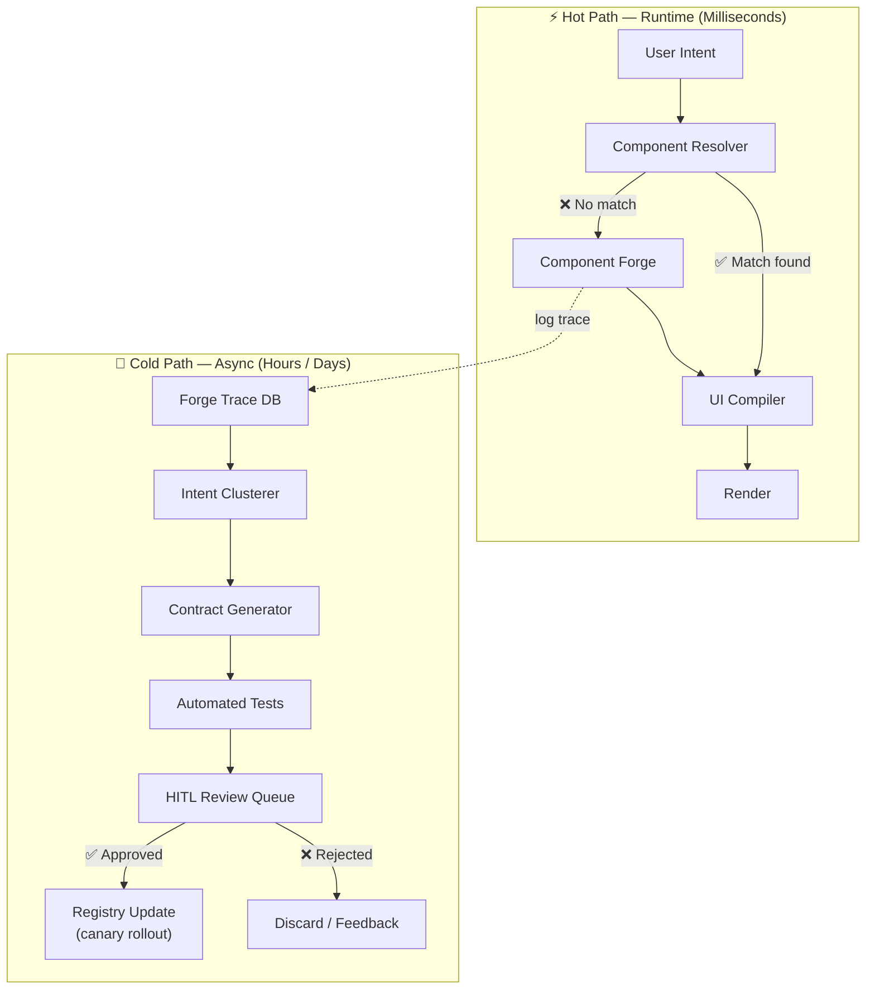
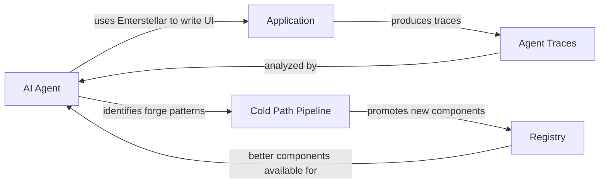
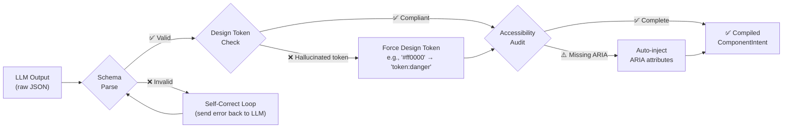
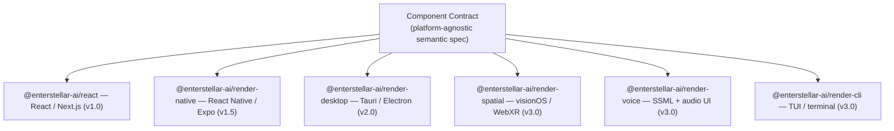

## The One-Sentence Architecture

Enterstellar is a **typed compilation layer** between any AI agent and any render target. It converts `{ component, props }` JSON into validated, token-compliant, accessible, observable UI — every time, without exception.

---

## The Full Pipeline

Every user interaction that reaches a `Zone` traverses the following sequence:

---

## The 6 Processing Steps

| Step | Name | Package | One Line |
|:---:|:---|:---|:---|
| **①** | **Normalizer** | `@enterstellar-ai/normalizer` | Converts AG-UI, A2UI, MCP, or raw JSON into a unified `ComponentIntent`. |
| **②** | **Semantic Index** | `@enterstellar-ai/semantic-index` | Embeds the intent and retrieves top-K most relevant components (~200 tokens). |
| **③** | **Component Resolver** | `@enterstellar-ai/registry` | Picks the best match. Below the confidence threshold → triggers the Forge. |
| **③b** | **Component Forge** | `@enterstellar-ai/forge` | Generates a `ComponentContract` on-the-fly for novel intents. Logs every invocation for the Cold Path. |
| **④** | **UI Compiler** | `@enterstellar-ai/compiler` | Validates props against the Zod schema. Enforces design tokens. Auto-corrects or falls back. |
| **⑤** | **Determinism Engine** | `@enterstellar-ai/cache` | Checks zone policy (0.0–1.0). Serves from render cache on hit. |
| **⑥** | **Lifecycle Manager** | `@enterstellar-ai/lifecycle` | Wraps the component in `loading`, `error`, `empty`, and `streaming` states. |

**L3 (locked):** Every `ComponentIntent` — whether from the registry or the Forge — passes through the UI Compiler. There is no fast path that bypasses validation.

---

## The Two-Speed Architecture

The pipeline separates into a Hot Path (milliseconds) and a Cold Path (hours to days):

The Hot Path serves the user. The Cold Path grows the registry. Every Forge invocation on the Hot Path feeds the Cold Path — the registry learns from every novel intent it sees.

The Cold Path pipeline has 6 phases:

| Phase | What Happens | Automation |
|:---:|:---|:---|
| **1. Collect** | Forge traces stored with intent, context, output. | Fully automated |
| **2. Cluster** | Similar unmatched intents grouped by threshold. | Fully automated |
| **3. Generate** | Full `ComponentContract` generated for cluster. | AI-assisted |
| **4. Test** | Zod schema, token compliance, axe-core a11y, responsive, visual regression. | Fully automated |
| **5. Review** | HITL queue — product/design team approves the contract. | Human decision |
| **6. Promote** | Canary rollout: 5% → 25% → 100%. Registry version auto-increments. | Automated deploy |

---

## The Forge Flywheel

The Forge is the runtime weapon. The Cold Path is the moat.

Every production render emits a mandatory `ForgeSignal` (L12 — zero PII, queued offline and synced on connectivity). Forged contracts are named `__forged_{name}_{8-char-hash}`, marked `_meta.forged: true`, and are ephemeral — they exist in memory only for the session.

---

## Strategic Moats

Every design decision in Enterstellar reinforces one or more of five strategic moats:

| Moat | What It Is | Where It Lives |
|:---|:---|:---|
| **M1: Compiler** | The type checker of GenUI. Schema + token + accessibility validation before any pixel renders. | `@enterstellar-ai/compiler` |
| **M2: ForgeSignal Corpus** | Mandatory zero-PII telemetry that feeds the Intent Router and Forge Model. More users → smarter routing. | `@enterstellar-ai/telemetry` |
| **M3: ComponentContract Standard** | The schema every component must conform to. If this becomes the industry standard, Enterstellar becomes the platform. | `@enterstellar-ai/registry`, `@enterstellar-ai/contract-protocol` |
| **M4: Intent Router** | Learns from ForgeSignal which intents map to which components. Gets better with every compilation. | `@enterstellar-ai/semantic-index`, `@enterstellar-ai/global-index` |
| **M5: Forge Model** | Fine-tuned on ForgeSignal to generate better contracts. Self-corrects from production data. | `@enterstellar-ai/forge` |

---

## The Compiler's 5-Step Pipeline

**Steps:**
1. **Parse** — Zod schema validation against the contract's `props` schema.
2. **Token check** — Every `token:*` reference resolved against the active `DesignTokenSet`. Raw hex values are coerced to nearest token (`ENS-2007` warning) or fail if no match (`ENS-2002`).
3. **Accessibility audit** — WAI-ARIA `role`, `ariaLabel`, `announceOnUpdate` checked. Auto-injected if `autoAccessibility: true`.
4. **Self-correction** — On schema parse failure, the error is sent back to the LLM as a structured message. Retry up to `maxRetries` times.
5. **Trace** — Every step emits trace events. `CompilationResult.status` is `'pass'`, `'corrected'`, or `'fail'` — never silent.

---

## Universal Rendering

The engine is platform-agnostic. Only renderers are platform-specific (L15 — enforced by CI):

`PatientVitals` on React renders as a card with charts. On Voice it renders as a spoken summary. The contract doesn't change. The renderer interprets it.

<Cards>
  <Card title="Design Principles →" description="The 15 non-negotiable principles (L1–L15) that govern every decision." href="/architecture/design-principles" />
  <Card title="Package Map →" description="All packages, their dependency edges, and their role in the pipeline." href="/architecture/package-map" />
</Cards>
