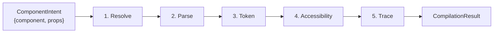

## The Core Guarantee

The LLM outputs `{ component: 'StatusCard', props: { title: 'API', value: 99.9, status: 'healthy' } }`.

Before that reaches the screen, the Compiler:
1. Verifies `StatusCard` exists in the registry.
2. Validates every prop against the Zod schema.
3. Verifies every `token:*` reference resolves in the design token set.
4. Checks and auto-injects required ARIA attributes.
5. Emits a full `AgentTrace` — every decision, every error, every step.

If any step fails, the Compiler doesn't render. It either self-corrects (sends the error back to the LLM for a retry) or falls back to `GenericCard`. **Raw LLM output never reaches the screen.**

## The 5-Step Pipeline



### Step 1: Resolve

Look up the component name in the registry. If it doesn't exist, the pipeline short-circuits — no further steps run. Error: `ENS-2004` (unknown component).

### Step 2: Parse

Run `schema.parse(props)` against the contract's Zod schema. Every field, every type, every enum value. If the LLM emitted `status: 'catastrophic'` on a schema that only allows `'healthy' | 'warning' | 'critical'`, the parse fails. Error: `ENS-2001` (schema parse failure).

### Step 3: Token

Verify every `token:*` reference in the compiled props resolves to a real path in the active `DesignTokenSet`. The compiler doesn't resolve token values — it only checks that the referenced token *exists*. Error: `ENS-2002` (invalid design token).

### Step 4: Accessibility

Check required ARIA attributes. If `announceOnUpdate: true` and the renderer's output doesn't include `aria-live`, the compiler auto-injects it. If a required `ariaLabel` is missing and cannot be inferred, the step emits a warning (not a failure — the component still renders).

### Step 5: Trace

Always runs last, regardless of custom middleware order. Builds the `AgentTrace` — a full record of every step's outcome, every error, every self-correction attempt, the component selected, and the total compilation time.

## Custom Middleware

Steps 1–4 are built-in and always run. You can add custom steps between step 4 and the trace via `compiler.use()`:

```ts
import { createCompiler } from '@enterstellar-ai/compiler';

const compiler = createCompiler({
  registry,
  onValidationFailure: {
    strategy: 'self-correct',
    maxRetries: 2,
    fallbackComponent: 'GenericCard',
  },
});

// Custom HIPAA compliance check — runs after a11y, before trace
compiler.use(async (context, next) => {
  const componentName = context.intent.component;
  if (containsPHI(context.props) && !isHIPAACompliant(componentName)) {
    context.errors.push({
      step: 'hipaa',
      code: 'ENS-custom-001',
      message: 'Component contains PHI but is not HIPAA-compliant.',
      path: 'props',
    });
    return context; // short-circuit — trace step still runs
  }
  return next();
});
```

Custom steps receive the `CompilationContext` and a `next` function. Calling `next()` continues the chain. Returning without `next()` short-circuits — but the trace step always runs last regardless.

## The Self-Correction Loop

When validation fails (step 2 or 3), the Compiler can send the Zod error messages back to the LLM for a retry. This is the "compile-time error" of GenUI:

```
LLM → { status: 'catastrophic' }
         ↓
    Compiler rejects: "status must be 'healthy' | 'warning' | 'critical'"
         ↓
    LLM retries: { status: 'warning' }
         ↓
    Compiler accepts → render
```

Max retries (default: 2) are configurable via `onValidationFailure.maxRetries`. After the limit, the compiler falls back.

## `CompilationResult`

A successful compilation returns:

```ts
type CompilationResult = {
  status: 'pass' | 'corrected' | 'fail';
  componentName: string;             // Resolved and validated
  props: Record<string, unknown>;    // Zod-parsed, safe to render
  errors: CompilationError[];        // Empty when status is 'pass' or 'corrected'
  selfCorrectionAttempts: number;
  provenance: CompilationProvenance; // How the component was selected
};
```

The `ZoneTrace` wraps this result with zone-level metadata (timing, retry count, timestamp) and writes it to the store for DevTools inspection.

<Cards>
  <Card title="Design Tokens →" description="How token references are validated in step 3 and resolved at render time." href="/concepts/design-tokens" />
  <Card title="Lifecycle →" description="How compilation status drives the zone's state machine transitions." href="/concepts/lifecycle" />
</Cards>
