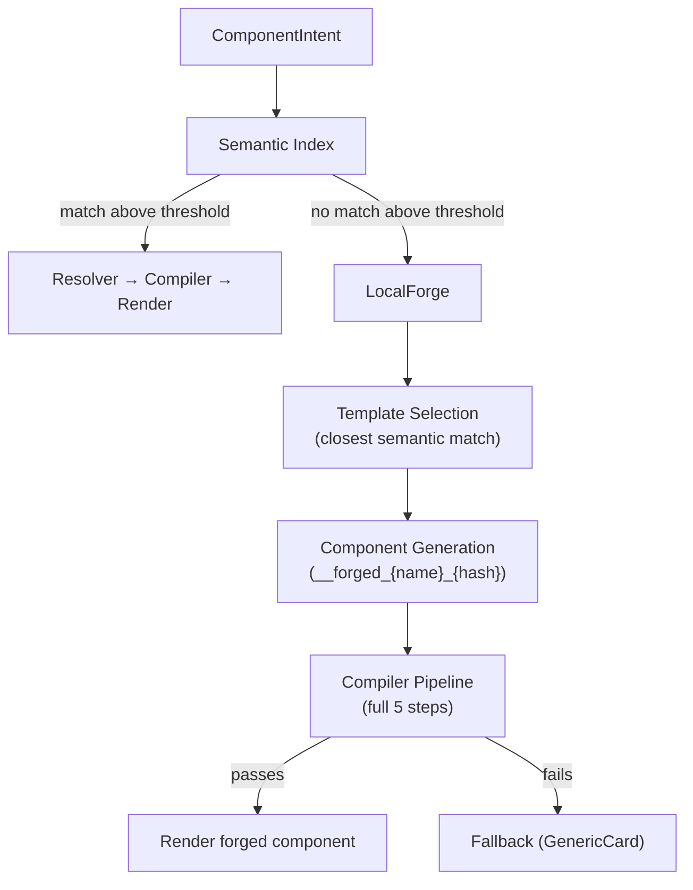

## What Happens When No Component Matches?

The Semantic Index searched. Nothing matched above threshold. The Registry has no `StatusCard` for this intent. Now what?

Without Forge: fallback component. The user sees a generic card.

With Forge: Enterstellar selects the closest template from your registry, generates a `__forged_` component from it, runs it through the full compiler pipeline, and renders it — or falls back if the generated output fails validation.

## LocalForge

LocalForge is the template-based generation engine (F1 locked). It doesn't call an external model. It picks the closest registered component template by semantic similarity, instantiates it with the intent's data, and passes the result to the Compiler.

The generated component goes through every pipeline step — resolve, parse, token, accessibility, trace — just like a registered component. If it passes, it renders. If it fails, the zone falls back.

## The Forge Lifecycle

## Known vs. Novel Intents

Most renders are instant: the Semantic Index finds a registry match, the Compiler validates it, the component renders. This is the **hot path**.

Forge renders are the **cold path**: `1–3 seconds` for template selection and generation. This is a deliberate trade-off — the cold path is slower, but it renders *something meaningful* instead of a generic fallback.

Your app should communicate this to the user. The zone's `streaming` state (showing the component's skeleton) covers the wait time. If the Forge takes longer than expected, the zone's `timeout` transitions to `error`.

## Forged Component Naming

Forged components have a distinct naming convention: `__forged_{name}_{8-char-hash}`.

For example: `__forged_MetricDisplay_a3f9b12c`.

This naming is intentional:
- The `__forged_` prefix is always visible in DevTools traces. It never pretends to be a registered component.
- The `{name}` segment comes from the closest template's name.
- The `{8-char-hash}` is derived from the intent + template combination for deterministic deduplication.

## The Promotion Pipeline (Cold Path)

Forged components are ephemeral by default — they exist for one render and are not registered. But Enterstellar includes a promotion pipeline that turns frequently-forged components into first-class registered contracts:

1. **Cluster** — Forge detects repeated similar intents.
2. **Generate** — A full `ComponentContract` is generated from the intent cluster.
3. **Automated testing** — Intent-based tests run against the generated contract.
4. **HITL review** — A human reviews and approves the contract.
5. **Canary** — The contract is deployed to a subset of traffic.
6. **Production** — The contract is promoted to the main registry.

After promotion, the component loses its `__forged_` prefix and gets a PascalCase name (F14 locked). Future requests for the same intent hit the hot path — no Forge needed.

## Forge in DevTools

Every forged render is visible in the Trace Timeline with a `🔨` badge. You can inspect:
- Which template was selected and why.
- The generated props before compilation.
- Whether validation passed or fell back.
- The full `AgentTrace` with the forged component's hash.

This visibility is intentional. Forge is a signal: **"your users need a component you haven't built yet."**

<Cards>
  <Card title="Component Contracts →" description="Build registered components to replace frequently-forged ones." href="/concepts/component-contracts" />
  <Card title="DevTools →" description="Inspect forge traces, template selection, and promotion candidates in the DevTools panel." href="/guides/devtools" />
</Cards>
