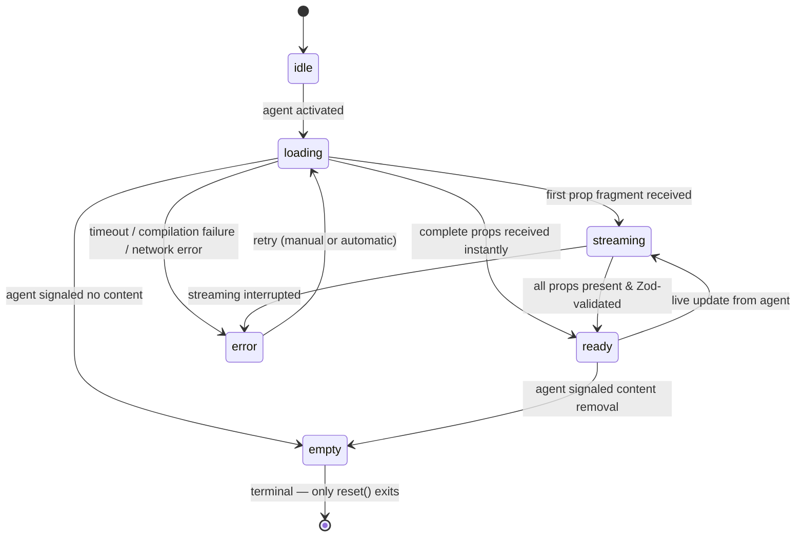

## The Finite State Machine

Every zone has a `LifecycleManager` — a deterministic FSM with 6 states and a fixed set of valid transitions.



Invalid transitions throw `ENS-3003`. There is no way to go from `ready` directly to `loading` — the agent sends a new intent, which transitions `ready → streaming` first.

## What Each State Means

Understanding what the user *sees* in each state is as important as knowing the transitions:

| State | What the user sees | What's happening |
|:---|:---|:---|
| `idle` | Nothing yet. | Zone mounted. Agent not yet called. |
| `loading` | `fallback` prop rendered. | Agent called. Waiting for first response. Timeout timer running. |
| `streaming` | `states.loading` skeleton. | Prop fragments arriving. `StreamingAssembler` accumulating. |
| `ready` | The actual component with full props. | Compilation succeeded. `ZoneTrace` written to store. |
| `error` | `states.error` card with Retry button. | Compilation failed or timeout. `onError` callback fired. |
| `empty` | `states.empty` placeholder. | Agent returned no content. Terminal — only `reset()` exits. |

## Why GenUI Needs a Lifecycle

Traditional UI has two states: loading (data fetch pending) and ready (data arrived). GenUI has a *generation phase* between them.

When a user sends an intent:
1. The LLM must decide what component to render.
2. The LLM must assemble the props — which can arrive as a stream of fragments.
3. The props must be validated against the Zod schema.
4. Only then does a component render.

This is a 50ms–3s window where the UI is genuinely uncertain. The lifecycle makes that window observable and gives you full control over what the user sees during it.

## Streaming Props

When the agent streams prop fragments (partial delivery), the `StreamingAssembler` accumulates them with path-based updates. The zone stays in `streaming` state — showing the component's `states.loading` skeleton — until all required props are present and the Zod schema passes a full `parse()`.

**No optimistic defaults (LC6).** The zone never renders partial props as if they were complete. It shows the skeleton until the data is structurally valid. This is a clinical safety decision: displaying partial vitals data is worse than displaying no data.

## Timeout

Every zone has a timeout. The default is 30 seconds (LC3). When the timer fires while in `loading` state, the FSM transitions to `error` with `ENS-3002` (agent timeout).

Configure per zone:

```tsx
{/* Low-tolerance zone: 10-second deadline */}
<Zone
  name="patient-alerts"
  determinism={1.0}
  fallback={<AlertsSkeleton />}
  timeout={10000}
/>
```

## Retry

The default retry policy is `{ auto: true, maxRetries: 3, backoff: 'exponential' }`. When a compilation fails, the FSM transitions `error → loading` (retry), runs the timer again, and attempts recompilation. After 3 failed attempts, the zone stays in `error` state and shows the error card with a user-initiated Retry button.

Override per zone:

```tsx
<Zone
  name="non-critical"
  determinism={0.8}
  fallback={<Skeleton />}
  retryPolicy={{ auto: false, maxRetries: 0, backoff: 'none' }}
/>
```

## Observing the Lifecycle

The `onError` callback fires on every terminal error with the `Error` object and the current `ZoneTrace`:

```tsx
<Zone
  name="dashboard"
  determinism={1.0}
  fallback={<Skeleton />}
  onError={(error, trace) => {
    console.error('Zone error:', error.message);
    console.log('Trace at failure:', trace);
  }}
/>
```

Full `ZoneTrace` objects are also written to the `EnterstellarStore` — trace IDs are tracked under the `'traceIds'` key (max 100, FIFO eviction). The DevTools panel reads these for the Trace Timeline.

<Cards>
  <Card title="Compilation →" description="What the compiler does in the loading → ready transition." href="/concepts/compilation" />
  <Card title="Zones →" description="How Zone props control lifecycle behavior (timeout, retryPolicy, fallback)." href="/concepts/zones" />
</Cards>
