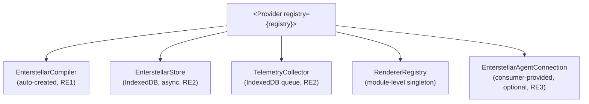

## The 1 Import Story

This is the minimum viable Enterstellar setup:

```tsx
import { Provider } from '@enterstellar-ai/react';
import { registry } from './enterstellar/registry';

export default function App() {
  return (
    <Provider registry={registry}>
      {/* your app */}
    </Provider>
  );
}
```

One prop. Everything else is automatic.

`Provider` auto-creates three core services from your registry:
- **`EnterstellarCompiler`** — validates every prop against your Zod schemas, enforces design tokens, and runs the 5-step pipeline before anything renders.
- **`EnterstellarStore`** — persists state to IndexedDB by default, with max 100 traces in FIFO eviction.
- **`TelemetryCollector`** — queues telemetry events to IndexedDB and flushes every 30 seconds.

You don't configure any of these unless you need to override them.

## What Provider Initializes



During initialization — while the store and telemetry are opening their IndexedDB connections — zones receive a `null` context and render their `fallback` prop. Once initialization is complete, the context is populated and zones proceed with normal compilation.

A `Zone` rendered with no `Provider` above it receives a sentinel value and throws `ENS-3001` immediately. No silent degradation.

## Props

### Required

| Prop | Type | Description |
|:---|:---|:---|
| `registry` | `EnterstellarRegistry` | The component deck. Created by `createRegistry()`. |
| `children` | `ReactNode` | Your app. |

### Optional — override auto-created services

| Prop | Type | Default | Description |
|:---|:---|:---|:---|
| `compiler` | `EnterstellarCompiler` | auto-created | Custom compiler with middleware, custom strategies. |
| `store` | `EnterstellarStore` | auto-created (IndexedDB) | Custom store — e.g., `memory` for testing. |
| `telemetry` | `TelemetryCollector` | auto-created (IndexedDB queue) | Custom telemetry collector. |

### Optional — consumer-provided services

| Prop | Type | Default | Description |
|:---|:---|:---|:---|
| `connection` | `EnterstellarAgentConnection` | `null` | Agent transport. If omitted, zones operate in static mode. |
| `cache` | `RenderCache` | `null` | Compiled intent cache. Opt-in — see [Custom Configuration](/guides/custom-configuration). |
| `adapters` | `EnterstellarAdapters` | `{}` | Auth, data, error, analytics adapters. |
| `threadId` | `string` | `undefined` | Persists conversation thread across sessions. Stored in `store.session.threadId`. |

## The Auto-Creation Pattern

`Provider` follows two design rules:

**RE1 — Auto-create compiler:** If no `compiler` prop is passed, `Provider` creates one with `onValidationFailure: { strategy: 'fallback', fallbackComponent: 'GenericCard' }`. This means validation failures silently fall back to `GenericCard` instead of throwing — a safe default for production.

**RE2 — Auto-create store and telemetry:** Both are async (IndexedDB connections). `Provider` initializes them in `useEffect` and sets context to `null` while waiting. Zones handle the `null` case by rendering their `fallback`.

**RE3 — Consumer manages connection:** The agent transport is not auto-created. You provide an `EnterstellarAgentConnection` (e.g., from `createAgentConnection()` in `@enterstellar-ai/connection`) — or you don't, and the zones stay static.

## With a Connection

```tsx
import { Provider } from '@enterstellar-ai/react';
import { createAgentConnection } from '@enterstellar-ai/connection';
import { registry } from './enterstellar/registry';

const connection = createAgentConnection({
  url: process.env.NEXT_PUBLIC_AGENT_URL!,
});

export default function App() {
  return (
    <Provider registry={registry} connection={connection}>
      {/* your app */}
    </Provider>
  );
}
```

## Client-Side Only

`Provider` uses the `'use client'` directive (RE4). It requires browser APIs — IndexedDB for the store and telemetry queue, `WebSocket`/`EventSource` for the connection. Do not render it in a Server Component.

<Cards>
  <Card title="Zones →" description="How Zone uses the Provider context to render AI-generated components." href="/concepts/zones" />
  <Card title="Custom Configuration →" description="Override the auto-created services with custom compiler, store, cache, and telemetry." href="/guides/custom-configuration" />
</Cards>
