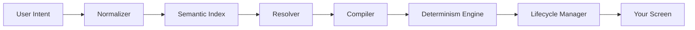

Enterstellar is the TypeScript of Generative UI.

## The Problem

Today's Generative UI has three unsolved problems:

- **The Trust Deficit.** The LLM can emit any component name, any prop value. Nothing stops it from hallucinating `status: "catastrophic"` on a patient vitals card.
- **The Review Paradox.** You can't ship fast *and* manually review every AI-generated layout. The two are in conflict.
- **The Bootstrap Problem.** Building safe GenUI requires a compiler, a registry, a test harness, and an agent protocol. Nobody ships that from scratch.

## The Solution

Enterstellar adds a *compiler* between the LLM and the screen. The LLM selects from a strict Component Registry — a closed deck of validated, type-safe cards. The Compiler validates every prop against a Zod schema, enforces your design tokens, and ensures accessibility — before a single pixel renders.

<Cards>
  <Card title="Valid" description="Every prop passes Zod schema validation before render." />
  <Card title="Safe" description="The LLM can never hallucinate outside your registered component set." />
  <Card title="Deterministic" description="The same intent produces the same output. Every time." />
  <Card title="Observable" description="Every render decision is traced. Full AgentTrace on every zone update." />
  <Card title="Testable" description="Write intent-based tests. No real LLM required." />
</Cards>

## How It Works

Every user intent flows through seven layers before anything renders:

<Callout type="info" title="Just like TypeScript">
TypeScript didn't replace JavaScript. It made JavaScript safe. Enterstellar doesn't replace React or your agent framework. It makes GenUI safe.

The LLM never generates HTML or JSX. It emits `{ component, props }` JSON. The compiler does the rest.
</Callout>

Enterstellar is NOT a UI library. It's the intelligence layer between your agent and your components. It's incrementally adoptable — add one `<Zone>` to your existing React app and expand from there.

<Cards>
  <Card title="Quick Start →" description="One command. Working app in under 30 seconds." href="/getting-started/quick-start" />
  <Card title="Manual Installation →" description="Add Enterstellar to your existing React app." href="/getting-started/manual-installation" />
</Cards>
